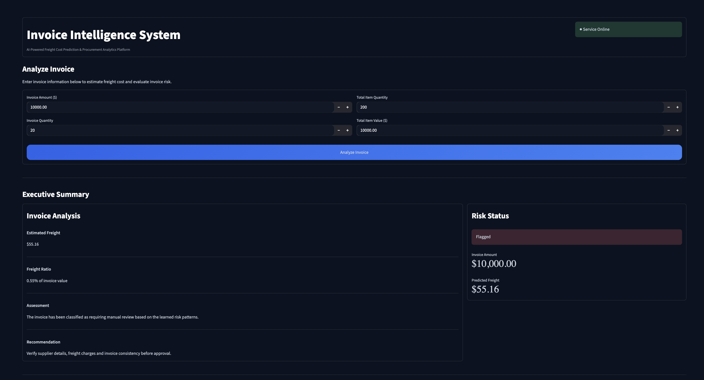
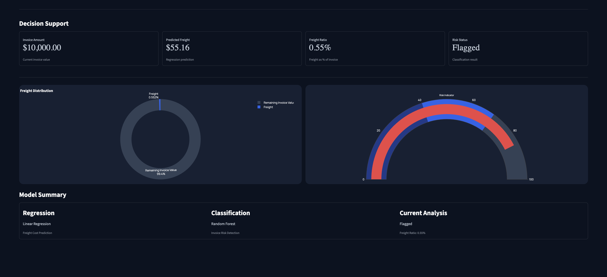

# 📊 Vendor Invoice Intelligence System

> 🚀 End-to-end Machine Learning platform for freight cost prediction and invoice risk detection using FastAPI, Streamlit, Scikit-learn, and SQLite.

An end-to-end Machine Learning application that predicts freight costs and identifies vendor invoices requiring manual review. The system integrates Machine Learning, FastAPI, SQLite, and Streamlit to provide procurement teams with intelligent decision support through an interactive analytics dashboard.

---

## 📌 Overview

Organizations process thousands of vendor invoices every month. Manually estimating freight costs and reviewing invoices for potential risks can be time-consuming and error-prone.

The Invoice Intelligence System automates these tasks using Machine Learning models exposed through a FastAPI backend and visualized using a Streamlit dashboard.

---

## 🎯 Project Objectives

### 🚚 Freight Cost Prediction

Predict the expected freight cost of an invoice using procurement data such as:

- Invoice Amount
- Invoice Quantity
- Total Item Quantity
- Total Item Value

### Benefits

- Improve procurement planning
- Estimate landed costs
- Support budgeting and forecasting
- Assist vendor negotiations

---

### 🚩 Invoice Risk Detection

Predict whether an invoice should be flagged for manual review.

### Benefits

- Reduce manual auditing
- Detect unusual invoice patterns
- Improve procurement efficiency
- Support business decision-making

---

# ✨ Features

- Freight Cost Prediction
- Invoice Risk Classification
- Interactive Business Dashboard
- Executive Summary
- Decision Support Metrics
- Data Visualizations
- FastAPI REST API
- SQLite Database Integration
- Machine Learning Model Inference

---

# 🏗️ System Architecture

```
                    Historical Procurement Data
                               │
                               ▼
                      SQLite Database
                               │
                               ▼
             Data Cleaning & Feature Engineering
                               │
                               ▼
                 Exploratory Data Analysis
                               │
                               ▼
                  Machine Learning Models
            ┌──────────────────┴──────────────────┐
            │                                     │
            ▼                                     ▼
 Freight Cost Prediction            Invoice Flag Prediction
      (Regression)                    (Classification)
            │                                     │
            └──────────────────┬──────────────────┘
                               ▼
                     Model Evaluation
                               │
                               ▼
                     Saved Models (.pkl)
                               │
                               ▼
                        FastAPI Backend
                               │
                               ▼
                     Streamlit Dashboard
                               │
                               ▼
                  Procurement Decision Support
```

---

# 📂 Project Structure

```
vendor-invoice-intelligence-system/

├── api/
├── dashboard/
├── data/                  # Dataset directory (not included in repository)
├── freight_cost_prediction/
├── inference/
├── invoice_flagging/
├── models/
├── notebooks/
├── README.md
├── requirements.txt
└── .gitignore
```
---

# 📁 Dataset

The project uses a procurement invoice dataset stored in a SQLite database for model training and evaluation.

> **Note:** The original dataset (`inventory.db`) is not included in this repository because it exceeds GitHub's file size limit (100 MB).

The trained machine learning models are included, allowing the application to perform predictions without requiring model retraining.

---

# 🛠️ Technology Stack

### Programming Language

- Python

### Machine Learning

- Scikit-Learn
- Pandas
- NumPy
- Joblib

### Backend

- FastAPI
- Uvicorn

### Frontend

- Streamlit
- Plotly

### Database

- SQLite

---

# 🤖 Machine Learning Models

## Regression

- Linear Regression
- Decision Tree Regressor
- Random Forest Regressor

Used for freight cost prediction.

---

## Classification

- Random Forest Classifier

Used for invoice risk detection.

---

# 📊 Model Evaluation

### Regression Metrics

- Mean Absolute Error (MAE)
- Root Mean Squared Error (RMSE)
- R² Score

### Classification Metrics

- Accuracy
- Precision
- Recall
- F1-Score

---

# 📸 Dashboard

## Invoice Analysis



---

## Analytics & Business Insights



---

# 🔌 REST API

### Endpoint

```
POST /analyze
```

### Sample Response

```json
{
    "predicted_freight": 55.16,
    "freight_ratio": 0.55,
    "invoice_flag": 1,
    "risk_status": "Flagged"
}
```

---

# 🚀 Installation

Clone the repository

```bash
git clone https://github.com/TwinkleK05/vendor-invoice-intelligence-system.git
```

Navigate to the project

```bash
cd vendor-invoice-intelligence-system
```

Install the required packages

```bash
pip install -r requirements.txt
```

---

# ▶️ Running the Project

### Start the FastAPI Backend

```bash
cd api
uvicorn main:app --reload
```

Open Swagger UI:

```
http://127.0.0.1:8000/docs
```

---

### Launch the Streamlit Dashboard

```bash
cd dashboard
streamlit run app.py
```

---

# 🌐 Live Demo

Deployment is currently in progress.

Future deployment will include:

- Streamlit Dashboard
- FastAPI REST API

---

# 🚀 Future Enhancements

- Cloud Deployment
- Docker Support
- Vendor-wise Analytics
- User Authentication
- Automated Model Retraining
- Report Generation (PDF & Excel)

---

# 💡 Skills Demonstrated

- Machine Learning
- Regression
- Classification
- Data Preprocessing
- Feature Engineering
- Model Evaluation
- FastAPI
- REST API Development
- Streamlit
- Plotly
- Data Visualization
- SQLite
- End-to-End ML Pipeline

---

# 👩‍💻 Author

**Twinkle Kolluri**

B.Tech Computer Science Engineering

Interested in Machine Learning, Data Science, Artificial Intelligence, and Backend Development.

---

## ⭐ Support

If you found this project useful, consider giving it a ⭐ on GitHub.